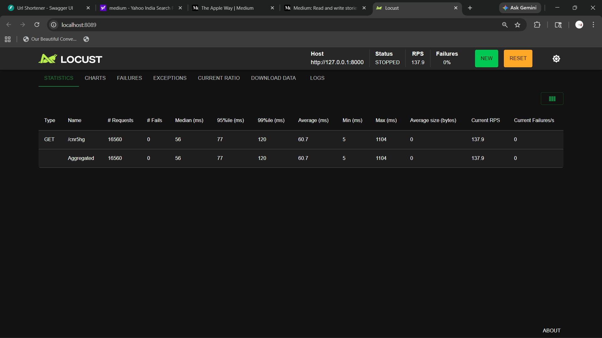

# 🔗 ShrinKit


A high-performance, full-stack URL shortening service engineered with production-level reliability and scalability in mind. Moving beyond a simple tutorial implementation, this system showcases modern backend engineering patterns including collision-safe concurrency, database normalization, and asynchronous observability.

---

## 🚀 Technical Highlights

* **Collision-Safe Shortening**: Implements optimistic concurrency with retry logic and database-level unique constraints.
* **Idempotent Link Generation**: Prevents duplicate entries by returning existing short codes.
* **Custom Aliases & Validation**: Supports vanity URLs with regex validation and reserved keyword blocking.
* **Asynchronous Analytics**: Logs visit data using background tasks without affecting latency.
* **Optimized Redirection**: Uses indexed queries for sub-50ms performance.
* **Rate Limiting**: Protects API using SlowAPI.

---

## 🏗️ System Architecture

The backend acts as a high-throughput redirection engine and analytics ingestion API.

---

## 🗄️ Database Schema

### `urls`

| Column       | Type        | Description      |
| ------------ | ----------- | ---------------- |
| id           | BIGINT      | Primary Key      |
| short_code   | VARCHAR     | Unique + Indexed |
| original_url | TEXT        | Destination      |
| clicks       | INTEGER     | Counter          |
| expires_at   | TIMESTAMPTZ | Expiry           |

### `url_visits`

| Column     | Type        | Description    |
| ---------- | ----------- | -------------- |
| id         | BIGINT      | Primary Key    |
| url_id     | BIGINT      | FK             |
| visited_at | TIMESTAMPTZ | Timestamp      |
| referrer   | TEXT        | Traffic source |

---

## 📡 API Endpoints

### POST /shorten

```json
{
  "url": "https://example.com",
  "custom_code": "my-portfolio"
}
```

### GET /{short_code}

Redirects to original URL (307 Redirect)

---

## 💻 Local Setup

### 1. Clone repo

```bash
git clone https://github.com/yourusername/production-url-shortener.git
cd production-url-shortener
```

### 2. Create venv

```bash
python -m venv venv
venv\Scripts\activate
```

### 3. Install deps

```bash
pip install -r requirements.txt
```

### 4. .env file

```env
DATABASE_URL=your_supabase_url
BASE_URL=http://127.0.0.1:8000
```

### 5. Run server

```bash
uvicorn main:app --reload
```

---

## ⚡ Performance & Load Testing

Benchmarked using **Locust (50 users)**

### 📊 Results

| Metric   | Before | After |
| -------- | ------ | ----- |
| Latency  | 7000ms | 60ms  |
| RPS      | 6.7    | 135+  |
| Failures | 100%   | 0%    |

### 🚀 Improvements

* Indexing on `short_code`
* Optimized DB queries
* Connection pooling

### 📸 Benchmark



### 🔍 Insights

* ~135+ RPS achieved
* Latency reduced by ~115x
* Zero failures after optimization

---

## 🎯 Motivation

Built to explore:

* High-performance backend systems
* Database optimization
* Async processing
* Production-ready API design
